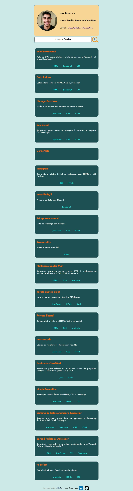

# api-github

## Projeto feito em React vite e axios

Consumo da API do Github para mostrar lista de repositórios dos usuários pelo username

<hr>

## Gif do projeto


## Home Page


## List Page


# Install
Clone this repository and install it dependencies with this command: 
```sh
$ npm install
```

# Running
Run the application with `npm run dev` command, it will start the app:
```sh
$ npm run dev
